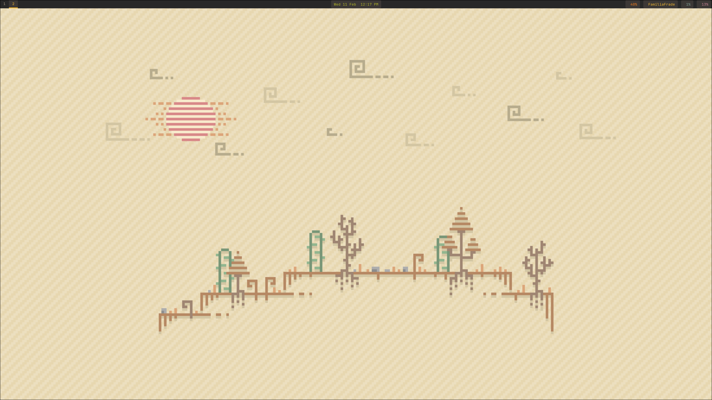
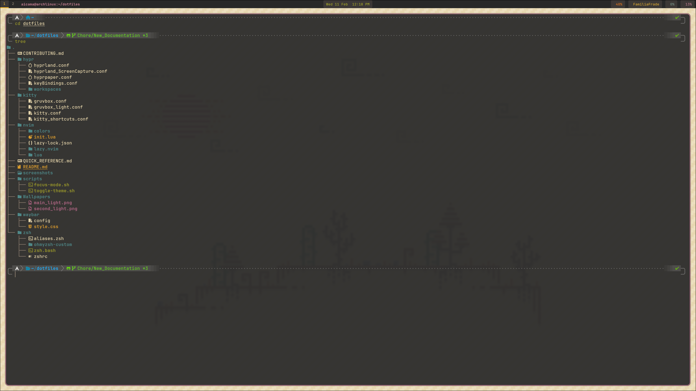
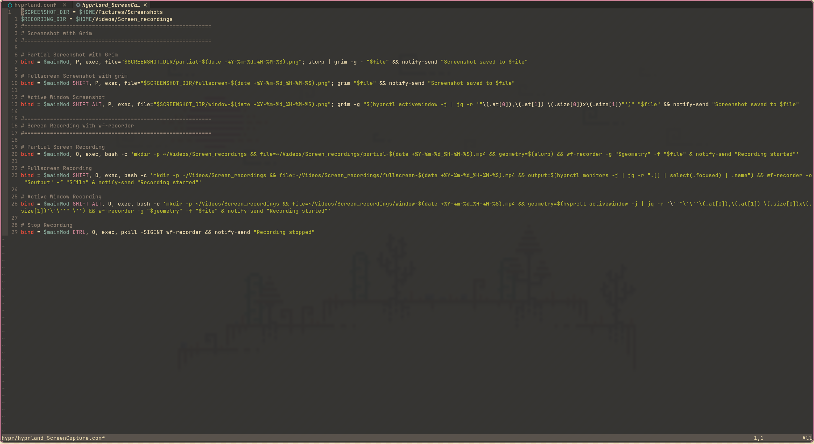

Screenshots
====

Hyprland
----



Terminal
----



Neovim
----




Dependencies
====

### Core tools

* **git** — Version control system
* **neovim** — Text editor
* **zsh** — Shell

### Terminal & CLI enhancements

* **bat** — `cat` clone with syntax highlighting
* **eza** — Modern replacement for `ls`
* **fzf** — Fuzzy finder
* **zoxide** — Smarter `cd` command
* **kitty** — Terminal emulator

### Wayland / Hyprland utilities

* **grim** — Screenshot utility
* **slurp** — Screen selection utility
* **wf-recorder** — Screen recording
* **waybar** — Status bar
* **hyprpaper** — Wallpaper manager
* **hyprlauncher** — Application launcher

### File management

* **dolphin** — File manager

### Media

* **mpv** — Media player

### Browsers

* **firefox** — Web browser
* **brave** — Web browser

Instalation
====

Clone the repository
----

```bash
# Clone with recurse-submodules
git clone --recurse-submodules https://github.com/Jose05Code/dotfiles.git
```

Install Dependencies
----

```bash
sudo pacman -S --needed --noconfirm \ 
    git \               
    neovim \            
    zsh \               
    bat \               
    eza \               
    fzf \               
    zoxide \            
    kitty \             
    grim \              
    slurp \             
    wf-recorder \       
    waybar \            
    hyprpaper \         
    hyprlauncher \      
    dolphin \           
    mpv \               
    firefox \           
    brave               
```

Create symbolic links
----

```bash
sudo pacman -S kitty
```

```bash
# ── Symbolic links for configuration files ─────────── 
ln -sf ~/dotfiles/zsh/zshrc ~/.zshrc
ln -sf ~/dotfiles/kitty/kitty.conf ~/.config/kitty/kitty.conf
ln -sf ~/dotfiles/zsh/.oh-my-zsh ~/.config/.oh-my-zsh
ln -sf ~/dotfiles/nvim ~/.config/nvim
ln -sf ~/dotfiles/waybar ~/.config/waybar
ln -sf ~/dotfiles/hypr ~/.config/hypr
```

Change default shell to zsh 
----

```bash
chsh -s $(which zsh)
```

Shortcuts
====

Hyprland Shortcuts -> ~/dotfiles/hypr/ 
----

### Custom Apps

| Action | Shortcut |
|---|---|
| `SUPER + Q` | Open Kitty Terminal |
| `SUPER + B` | Open Brave Browser |
| `SUPER + L` | Open Firefox Browser |
| `SUPER + E` | Open Dolphin File Manager |
| `SUPER + R` | Open HyprLauncher |

### Terminal commands

| Action | Shortcut |
|---|---|
| `SUPER + C` | Close focused window |
| `SUPER + M` | Log out of Hyprland session |
| `SUPER + V` | Toggle floating mode for focused window |

### Move focus windows

| Action | Shortcut |
|---|---|
| `SUPER + left` | Move focus to the left window |
| `SUPER + right` | Move focus to the right window |
| `SUPER + down` | Move focus to the down window |
| `SUPER + up` | Move focus to the up window |

### Screenshot and recording

| Action | Shortcut |
|---|---|
| `SUPER + P` | Take a partial screenshot using slurp |
| `SUPER + SHIFT + P` | Take a full screenshot using grim |
| `SUPER + SHIFT + ALT + P` | Active window screenshot using grim |
| `SUPER + O` | Start partial screen recording using wf-recorder |
| `SUPER + SHIFT + O` | Start full screen recording using wf-recorder |
| `SUPER + SHIFT + ALT + O` | Start active window recording using wf-recorder |
| `SUPER + CTRL + O` | Stop screen recording using wf-recorder |

Kitty Shortcuts -> ~/dotfiles/kitty/kitty_shortcuts.conf
----

### Copy and paste buffers

| Action | Shortcut |
|---|---|
| `F1` | copy to clipboard a| 
| `F2` | copy to clipboard b|
| `F3` | copy to clipboard c|
| `F4` | copy to clipboard d|
| `ALT + F1` | paste from clipboard a|
| `ALT + F2` | paste from clipboard b|
| `ALT + F3` | paste from clipboard c|
| `ALT + F4` | paste from clipboard d|

### Tabs management

| Action | Shortcut |
|---|---|
| `CTRL + SHIFT + Q` | Create new tab |
| `CTRL + SHIFT + W` | Close current tab |
| `CTRL + SHIFT + 1` | Detach current tab |
| `CTRL + SHIFT + 2` | Detach and ask current tab |
| `CTRL + SHIFT + ALT + Q` | Change title of current tab |

### Window management

| Action | Shortcut |
|---|---|
| `CTRL + SHIFT + TAB` | New window |
| `CTRL + ALT + SHIFT + TAB` | Close current window |
| `CTRL + SHIFT + F1` | detach window |
| `CTRL + SHIFT + F2` | detach and ask window |
| `CTRL + SHIFT + UP` | Resize window up |
| `CTRL + SHIFT + DOWN` | Resize window down |


